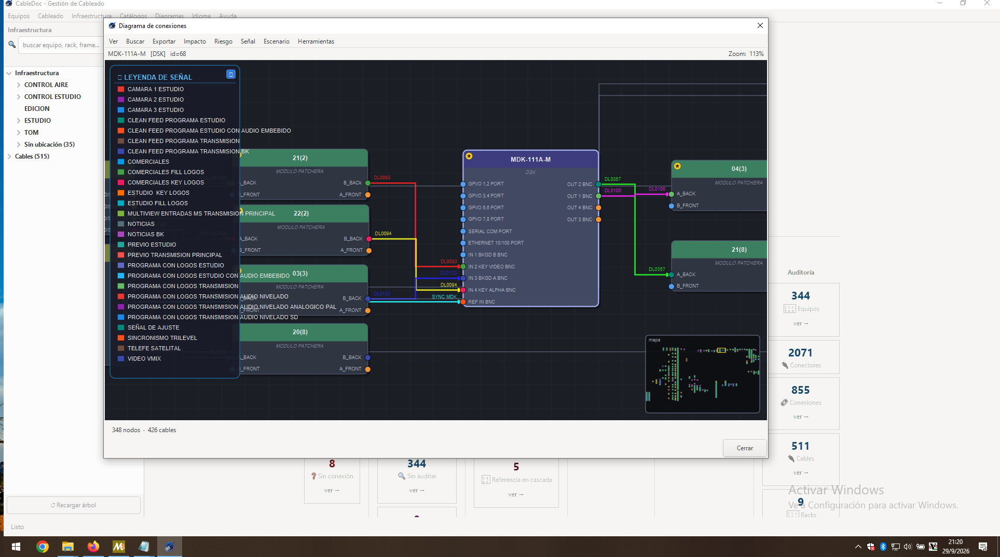

<p align="center">
  
</p>

# CableDoc

**Broadcast cable and infrastructure management software.**

CableDoc is a desktop and smartphone application for documenting and analyzing the cabling
and signal flow of a real broadcast/AV facility (digital and analog video and audio chain). It manages the physical infrastructure — equipment,
connectors, cables, connections, racks, frames, slots, patch bays, routing matrices, and signal entities — and layers impact
analysis, risk scoring, and fault diagnosis on top of it.

Development is AI assisted, driven by real cases found during on-site cabling surveys.

> The application's UI, domain vocabulary, comments, and changelog are
> entirely in **Spanish**, since it is built for and used by a real
> broadcast facility. This README is in English for the repository; the
> application itself remains in Spanish, with English/Portuguese available
> as translated UI languages.

- **Platforms**: Linux (Python 3 + GTK3, primary target), Windows 10 64-bit
  (via MSYS2 UCRT64), and Android (Kivy port running on Pydroid 3).
- **Origin**: successor to a VB.NET/WinForms predecessor, fully ported to
  Python/GTK3 (a ~26-page LaTeX/PDF technical write-up comparing both
  architectures lives in `ui_gtk/help/`). 
- **License**: GNU GPL v2 (see [`LICENSE`](./LICENSE)).
- **Author**: fschpp.

---

## What it does

- **Physical infrastructure documentation**: rooms, racks, frames, slots,
  equipment, connectors, and cables, positioned over reference images —
  including SVG images, which stay crisp at any zoom level. Position data
  is stored as **percentages of image width/height** (not raw pixels), so
  connector/slot positions survive swapping in a differently-sized image.
- **Cable & connector tracking**: full connection graph between equipment,
  including patch panels (`patchera`, with front/back row modeling —
  `A_BACK`/`B_BACK`/`A_FRONT`/`B_FRONT` — and full-normal jack bypass
  behavior), routing matrices (`rol_senal = ENRUTADOR`, with recursive
  resolution across cascaded matrices), and disconnected/"phantom"
  endpoints (`FANTASMA`) for cable ends confirmed absent in the field.
- **Cable extensions**: direct point-to-point cable joins (`Extensión`, as
  opposed to `Empalme`/barrel couplers), with full bidirectional chain
  resolution ("view full chain").
- **Signal chain modeling**: signals (`senal`) traced through connectors,
  with role tagging (`rol_senal`) and a documentation-only lineage graph
  (`senal_linaje`) that records how a signal was derived without feeding
  it into automated impact analysis.
- **"What breaks if I disconnect this?" impact analysis**
  (`graph_impact.py`, `GraphImpactAnalyzer`): propagates the effect of
  removing a cable/connector/equipment across AND/OR logical rules
  (`regla_logica`, e.g. DSK-style gates) and routing matrices, and reports
  exactly which downstream equipment and rules are affected — modeled at
  connector granularity so internal routing (e.g. inside a matrix) is
  simulated accurately.
- **Visual diagrams**: Cairo-rendered rack views, an interactive
  connections diagram (`DiagramaConexiones`) with drag-and-drop cabling,
  auto-layout, incomplete-connection overlays, and free-form custom
  diagrams (`diagrama_personalizado.py`), plus dedicated signal-risk and
  signal-state diagrams.
- **Incident log & analog risk tracking** (`bitacora_ui.py`,
  `riesgo_analogico.py`): records incidents, flags "suspect zones"
  (`zona_sospechosa`), and scores analog-chain risk using configurable,
  linear-decay weighting.
- **Structural signal risk** (`signal_risk.py`, `risk_engine.py` /
  Failure Risk Index): risk scoring based on balance, attenuation, and
  bandwidth characteristics of the signal chain.
- **Fault diagnosis assistant** (`diagnostico_falla.py`,
  `diagnostico_ui.py`): guided troubleshooting based on the documented
  signal chain and logged incidents.
- **Operational scenarios** (`escenario_engine.py`, `escenario_ui.py`):
  model and compare contingency/operational configurations — including
  virtual reconnection — against the documented infrastructure.
- **Catalog with JSON import/export** (equipment/frame/connector
  templates), with a deduplicated image pool.
- **Multi-language UI** (`i18n.py`): Spanish as the primary language, with
  English and Portuguese translations, and an AST-based string-wrapping
  pipeline (`auto_wrap.py`) to keep new code translatable.

## Screenshots

### Desktop (Windows 10, GTK3 via MSYS2)

Interactive connections diagram with the signal legend and the mini-map,
over the main window with the infrastructure tree and the pending-work
dashboard.

<p align="center">
  
</p>

### Mobile (Android, Kivy on Pydroid 3)

<table>
  <tr>
    <td align="center" width="33%">
      <br>
      <sub>Home: totals, quick access and pending work</sub>
    </td>
    <td align="center" width="33%">
      <br>
      <sub>Equipment list with search and filters</sub>
    </td>
    <td align="center" width="33%">
      <br>
      <sub>Equipment editing and quick actions</sub>
    </td>
  </tr>
  <tr>
    <td align="center" width="33%">
      <br>
      <sub>Connections diagram</sub>
    </td>
    <td align="center" width="33%">
      <br>
      <sub>Patch bays of an equipment</sub>
    </td>
    <td align="center" width="33%">
      <br>
      <sub>Connector image and connection table</sub>
    </td>
  </tr>
</table>

## Current status

_Last update of this README: 2026-09-29 — app version `1.20260929140000`
(`APP_VERSION` in `ui_gtk/cabledoc.py`)._

| Frontend | Stack | Status |
|---|---|---|
| **Desktop** (`ui_gtk/`) | Python 3 + GTK3 (PyGObject) + Cairo | Main, most complete frontend. Developed and used on **Linux**; also runs on **Windows 10 64-bit** through MSYS2 (see below). |
| **Mobile** (`ui_kivy/`) | Python 3 + Kivy | Port for Android, run through **Pydroid 3**. Phases 1–6 of the GTK → Kivy migration are done (catalogs, cables, equipment, connections, racks, frames, slots, patch bays, diagrams, scenarios, risk, diagnosis…). See `PROGRESS_INTEGRACION_MOBILE.md` for what is still pending. |
| **Shared core** (`core/`) | Pure Python + SQLite | Data layer, impact/risk engines and i18n, shared by both frontends. Same `db.db` database. |

Recent work (see [`changelog.txt`](./changelog.txt) and
[`PROGRESS.md`](./PROGRESS.md) for the full, timestamped history):

- **"Implicit intelligence" plan** (`plan_inteligencia_implicita_v1.md`):
  criticality ranking based on the Failure Risk Index (IRF) and a
  **topology linter** (`core/linter_topologia.py`) with rules such as
  *Fuera de patchera*, *Loop en uso*, *Referencia en cascada* and
  *Fuera de distribuidor*.
- **"Trabajo pendiente" (pending work) dashboard** on the main window,
  organized in columns: Cables, Equipos, Topología, Frames, Riesgo de señal
  and Auditoría (including an audit-SLA card).
- Audit tracking (`ultima_auditoria_fecha`), incident log, operational
  scenarios, fault diagnosis, custom diagrams and catalog JSON
  import/export with a deduplicated image pool.
- Windows fix: the drag-and-drop debug log no longer assumes a `/tmp`
  directory (it now uses the system temporary directory).

Known limitations: the app has been tested mainly on Linux; Windows/MSYS2
and Pydroid 3 support is newer and less battle-tested. On Android, SVG
rendering depends on `pygame` (usually preinstalled in Pydroid 3) and falls
back to `svglib`/`rlPyCairo`, which may not compile on-device.

## Installation and running

The project uses a per-project virtual environment in `.venv/`, and the
launch scripts (`lanzar.sh`, `lanzar_mobile.sh`) expect it to exist.

Get the code first:

```bash
git clone https://github.com/fschpp/CabledocDesktop.git
cd CabledocDesktop
```

(or download the ZIP from GitHub and extract it, if you don't have `git`).

### Linux (Debian / Ubuntu) — GTK3

1. Install the system packages. PyGObject and GTK are best installed from
   the distribution, not from `pip`:

   ```bash
   sudo apt update
   sudo apt install python3 python3-venv python3-gi python3-gi-cairo \
        gir1.2-gtk-3.0 gir1.2-rsvg-2.0 python3-pil
   ```

   - `gir1.2-rsvg-2.0` is required to display `.svg` reference images
     (without it they show a placeholder explaining what is missing).
   - `python3-pil` (Pillow) is optional, for image preview support.

2. Create the virtual environment **with access to the system packages**
   (so it can see `gi`):

   ```bash
   python3 -m venv --system-site-packages .venv
   source .venv/bin/activate
   ```

3. Launch:

   ```bash
   chmod +x lanzar.sh
   ./lanzar.sh
   ```

   `lanzar.sh` simply runs `.venv/bin/python ui_gtk/cabledoc.py`.

Other distributions: Fedora `sudo dnf install python3-gobject gtk3
librsvg2`, Arch `sudo pacman -S python-gobject gtk3 librsvg`.

> Alternative: if you prefer a venv **without** system site packages, you
> must build PyGObject with `pip install pygobject`, which needs
> `libgirepository1.0-dev libcairo2-dev pkg-config python3-dev` (see
> `requirements-desktop.txt`). The `--system-site-packages` route above is
> simpler and recommended.

### Windows 10 (64-bit) — MSYS2

CableDoc runs on Windows through MSYS2, which provides GTK3 and PyGObject.

1. Download and run the MSYS2 installer from <https://www.msys2.org/>
   (direct link to the release used here:
   <https://github.com/msys2/msys2-installer/releases/download/2026-09-27/msys2-x86_64-20260927.exe>).
2. Open the **MSYS2 UCRT64** shell from the Start menu (the packages below
   are the `ucrt-x86_64` ones, so use that shell and not "MSYS" or "MINGW32").
3. Update the system (the shell may ask you to close and reopen it; run the
   command again afterwards until it reports nothing left to do):

   ```bash
   pacman -Syu
   ```

4. Install Python, PyGObject and GTK3:

   ```bash
   pacman -S mingw-w64-ucrt-x86_64-python
   pacman -S mingw-w64-ucrt-x86_64-python-gobject
   pacman -S mingw-w64-ucrt-x86_64-gtk3
   ```

   Optional, but recommended:

   ```bash
   pacman -S mingw-w64-ucrt-x86_64-librsvg          # display .svg images
   pacman -S mingw-w64-ucrt-x86_64-python-pillow    # image previews
   ```

5. Go to the project folder (your Windows `C:\` drive is `/c/` in MSYS2;
   the MSYS2 home lives in `C:\msys64\home\<user>\`), then create and
   activate the virtual environment, again **with system site packages**:

   ```bash
   cd ~/cabledoc          # or wherever you put the repository
   python -m venv --system-site-packages .venv
   source .venv/bin/activate
   ```

6. Launch:

   ```bash
   chmod +x lanzar.sh
   ./lanzar.sh
   ```

> Make sure you have the latest `ui_gtk/panel_arbol_ui.py`: older versions
> wrote a debug log to `/tmp/cabledoc_drag_drop.log` and crashed on Windows
> with `FileNotFoundError`.

### Android — Pydroid 3 (Kivy port)

The mobile port lives in `ui_kivy/` and reuses `core/` and the same
database.

1. Install **Pydroid 3** from Google Play:
   <https://play.google.com/store/apps/details?id=ru.iiec.pydroid3&hl=en&pli=1>
2. Get the code onto the device: download the repository ZIP from GitHub
   and extract it somewhere accessible (for example
   `/storage/emulated/0/CableDoc/`). The folder must keep the `core/`,
   `ui_kivy/` and `data/` directories together.
3. In Pydroid 3 open the **Pip** page from the menu and install the
   dependencies listed in `requirements-mobile.txt`:
   - `Kivy` (required) and `Pillow` (required; used to measure raster
     images, since `gi`/GdkPixbuf is not available on Android).
   - `pygame` (primary SVG rasterizer; Pydroid 3 usually already ships it —
     try `import pygame` from the Pydroid console before installing).
   - `svglib`, `reportlab`, `rlPyCairo` are only a fallback for SVGs that
     `pygame`/NanoSVG cannot render, and `rlPyCairo` may fail to compile on
     the device. Skip them unless you need them.
4. Open `ui_kivy/main.py` from Pydroid 3 (menu → *Open*) and press the
   **▶ Run** button.
5. On first run the database is created from `data/schema_db.sql` (schema
   only). To work with your real data, copy your `db.db` into
   `data/database/` and your images into `data/imagen/`, `data/manuales/`
   and `data/picon/` (the project syncs them between desktop and mobile
   with rclone / RoundSync, see `data/README.md`).

On a desktop Linux you can also test the Kivy port with
`pip install -r requirements-mobile.txt` inside the venv and
`./lanzar_mobile.sh`.

### First run and data

On first run, if `data/database/db.db` does not exist it is created
automatically from `data/schema_db.sql` (schema only, no data), together
with the `imagen/`, `manuales/` and `picon/` support directories under
`data/`. The `db.db` file is git-ignored on purpose: it is production data.

## Requirements summary

- Python 3
- GTK3 through PyGObject (desktop) — `requirements-desktop.txt`
- SQLite (standard library `sqlite3`)
- Pillow (optional on desktop, required on mobile)
- **Rsvg GObject-introspection binding** to render `.svg` reference images:
  `gir1.2-rsvg-2.0` (Debian/Ubuntu), `mingw-w64-ucrt-x86_64-librsvg`
  (MSYS2). It is a system typelib, not a `pip` package. Without it, SVG
  images degrade gracefully to a placeholder that states the specific
  reason instead of failing.
- Kivy, Pillow, pygame (mobile) — `requirements-mobile.txt`

## Architecture

The repository is split in four top-level directories:

| Directory | Contents |
|---|---|
| `core/` | UI-independent logic shared by desktop and mobile: `modelo.py` (SQLite data layer, class `Modelo`), `graph_impact.py` (impact analysis), `risk_engine.py` (IRF), `signal_risk.py`, `riesgo_analogico.py`, `senal_*.py` (signal state / propagation / visual resolution), `escenario_engine.py`, `diagnostico_falla.py`, `linter_topologia.py`, `i18n.py`, `logger_cabledoc.py` |
| `ui_gtk/` | Desktop frontend (GTK3 + Cairo), entry point `ui_gtk/cabledoc.py` |
| `ui_kivy/` | Mobile frontend (Kivy), entry point `ui_kivy/main.py` |
| `data/` | `schema_db.sql` (schema source of truth) and, at runtime, `database/db.db`, `imagen/`, `manuales/`, `picon/` |

The app follows a **mixin composition** pattern for its largest screens:
`DiagramaConexiones`, the interactive connections diagram, is assembled
from several focused `*Mixin` classes rather than one monolithic class.

| Layer (`ui_gtk/`) | Files |
|---|---|
| Entry point / main window, ABM | `cabledoc.py` |
| Shared screen utilities (i18n bootstrap, icons, Cairo primitives, `PALETA`) | `pantallas_comunes.py` |
| Rack / frame / connector screens | `rack_ui.py`, `frame_slots_ui.py`, `imagen_conectores_ui.py`, `arbol_conexiones_ui.py`, `panel_arbol_ui.py` |
| Patch panels | `patcheras_ui.py` |
| Bulk editors (connectors / slots, real equipment & catalog) | `editor_masivo_conectores_ui.py`, `editor_masivo_slots_ui.py` |
| Connections diagram + mixins | `diagrama_conexiones_ui.py`, `grafo_diagrama_ui.py`, `dibujo_diagrama_ui.py`, `interaccion_diagrama_ui.py`, `edicion_conexiones_diagrama_ui.py`, `layout_diagrama_ui.py`, `busqueda_diagrama_ui.py`, `export_diagrama_ui.py`, `ruteo_interno_diagrama_ui.py` |
| `pantallas_avanzadas.py` | Pure facade (see below) |
| Impact / risk / signal UIs | `impacto_ui.py`, `riesgo_diagrama_ui.py`, `signal_risk_diagrama_ui.py`, `senal_diagrama_ui.py`, `senal_visual_ui.py`, `senal_catalogo_ui.py` |
| Incident log, audit, diagnosis, scenarios | `bitacora_ui.py`, `auditoria_diagrama_ui.py`, `cobertura_auditoria_ui.py`, `config_sla_auditoria_ui.py`, `diagnostico_ui.py`, `escenario_ui.py` |
| Cable extensions | `extension_cable_ui.py` |
| Custom diagrams | `diagrama_personalizado.py` |
| Catalogs and ABM screens | `catalogos_basicos_ui.py`, `catalogo_equipos_ui.py`, `equipos_ui.py`, `conectores_ui.py`, `cables_conexiones_ui.py`, `racks_salas_ui.py`, `planos_ui.py` |
| About dialog | `acerca_de.py` (renders `README.md` and `changelog.txt` inside the app) |
| One-off migration script | `convertir_archivos.py` (pixel → percentage coordinate migration) |

### `pantallas_avanzadas.py`: from ~11,000-line monolith to a pure facade

`pantallas_avanzadas.py` defines no classes or functions of its own — it
only re-exports names (`ArbolConexionesEquipo`, `VistaRack`,
`PatcherasVista`, `VistaFrameSlots`, `DiagramaConexiones` and its helper
dialogs, the bulk editors, etc.) from their new homes, under the exact
names `cabledoc.py` and `diagrama_personalizado.py` used before the
refactor. This facade pattern meant neither of those two consumers needed
any changes across the whole refactor.

## Project structure

```
lanzar.sh                  # Launches the desktop app (.venv/bin/python ui_gtk/cabledoc.py)
lanzar_mobile.sh           # Launches the Kivy port on a desktop (.venv/bin/python ui_kivy/main.py)
requirements-desktop.txt   # Desktop dependencies (PyGObject)
requirements-mobile.txt    # Mobile dependencies (Kivy, Pillow, pygame, ...)
core/                      # Shared logic (data layer, engines, i18n)
ui_gtk/                    # Desktop GTK3 frontend
  cabledoc.py              #   Main entry point / main window / ABM
  assets/                  #   App icons and images
  help/                    #   User tutorials (Markdown) and technical write-ups (LaTeX/PDF)
ui_kivy/                   # Mobile Kivy frontend (entry point: main.py)
data/
  schema_db.sql            #   Full database schema (~44 tables, 14 views)
  database/db.db           #   SQLite database (created on first run, git-ignored)
  imagen/  manuales/  picon/   # Reference images, manuals, equipment picons
PROGRESS*.md, plan_*.md    # Work logs and design plans
changelog.txt              # Timestamped change history
```

## Development notes

- **`pyflakes` is mandatory before any delivery is considered complete.**
  It is the only tool that reliably catches `NameError`s inside GTK draw
  callbacks — GTK silences these at runtime (a black surface or a missing
  node, not a crash), so `ast.parse` / `py_compile` / import-chain smoke
  tests alone are not enough.
- **Facade pattern**: as modules are extracted, they re-export their
  public names back through `pantallas_avanzadas.py`, so dependent modules
  need zero changes per delivery.
- **Anti-hardcoding principle**: behavior is driven by explicit catalog
  columns (`tipo_equipo.rol_senal`, `tipo_conector.direccion`, etc.) with
  `COALESCE()`-based overrides, never by matching equipment/connector
  *names* or IDs in business logic — new equipment/connector types must
  work correctly without any code change.
- **`senal_linaje` is documentation-only by design** and intentionally
  does not feed `graph_impact.py` — this separation is deliberate, not an
  oversight.
- **`FANTASMA` means confirmed absence in the field**, not "unknown" — the
  impact-propagation engine already handles it without special-casing.
- Deferred, in-method imports are the established pattern for breaking
  circular dependencies between `cabledoc.py` ↔ `pantallas_avanzadas.py` ↔
  the `*_ui.py` modules — this must be preserved in any further refactor.
- Every delivery updates `PROGRESS.md` / `PROGRESS_REFACTOR.md`, appends a
  timestamped, one-line-per-change entry to `changelog.txt`, and bumps
  `APP_VERSION` in `ui_gtk/cabledoc.py` (format `1.YYYYMMDDHHMMSS`).
- User-facing help lives in `ui_gtk/help/TUTORIAL_*.md`, updated alongside each
  user-visible feature.

## License

GNU General Public License v2.0 — see [`LICENSE`](./LICENSE).
